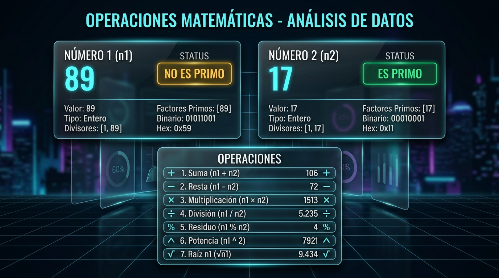

# ⚡ Sumadora Chava 3D

<div align="center">


**Calculadora Científica 3D WebGL con Análisis de Operaciones y Primalidad de $n_1$ y $n_2$ desarrollada en Flutter.**

[](https://flutter.dev)
[](https://dart.dev)
[](https://threejs.org)
[](https://blog.cleancoder.com/uncle-bob/2012/08/13/the-clean-architecture.html)
[](test/)
[](lib/)

</div>

---

## 📖 Índice

- [Visión General](#-visión-general)
- [Características Principales](#-características-principales)
- [Operaciones Matemáticas y Primalidad](#-operaciones-matemáticas-y-primalidad)
- [Estructura del Proyecto (Clean Architecture)](#-estructura-del-proyecto-clean-architecture)
- [Requisitos Previos](#-requisitos-previos)
- [Guía de Instalación y Ejecución](#-guía-de-instalación-y-ejecución)
- [Pruebas Automatizadas y Análisis](#-pruebas-automatizadas-y-análisis)
- [Controles y Atajos de Teclado](#-controles-y-atajos-de-teclado)
- [Tecnologías y Librerías](#-tecnologías-y-librerías)
- [Créditos y Licencia](#-créditos-y-licencia)

---

## 🌟 Visión General

**Sumadora Chava 3D** une el poder del desarrollo multiplataforma en **Flutter** con el renderizado 3D acelerado por hardware en **Three.js (WebGL)**. 

A diferencia de las calculadoras tradicionales, la aplicación cuenta con un **modelo 3D completamente procedural** (sin dependencias de archivos `.gltf` o `.obj` pesados), física interactiva de pulsado de teclas, síntesis de audio procedural en tiempo real y una pantalla LCD OLED nítida y minimalista. Además, incorpora un motor matemático con el algoritmo **Shunting-Yard** de Dijkstra y análisis de **primalidad** $O(\sqrt{n})$ para los operandos $n_1$ y $n_2$.

---

## ✨ Características Principales

- 🎮 **Modelo 3D Interactivo en WebGL**: Chasis metálico satinado con bordes biselados procedurales, iluminación de estudio con sombras suaves (`PCFSoftShadowMap`) y luces puntuales de acento neón.
- 🔘 **Física Visual con Rebote TWEEN**: Detección de clics en 3D mediante `THREE.Raycaster`. Al tocar una tecla, desciende en el eje $Y$ con interpolación `Quadratic.Out` y rebote elástico `Back.Out`.
- 🔊 **Audio Procedural (Web Audio API)**: Generación de tonos sinusoidales por código al interactuar con las teclas, sin necesidad de cargar archivos de audio externos.
- 🎯 **Tecla 3D `CENTRAR` Integrada**: Tecla dedicada en el teclado 3D que restablece suavemente la cámara y la órbita a la vista frontal óptima.
- 📟 **Pantalla LCD OLED Procedural y Limpia**: Lienzo en memoria de $1200 \times 460$ píxeles que dibuja fórmulas y resultados en alta definición con tipografía monoespaciada sin elementos distractores.
- 🪟 **Interfaz Flotante Glassmorphism**: Paneles modales en Flutter nativo con desenfoque de fondo (*backdrop filter*), bordes brillantes y diseño Cyberpunk.
- 📜 **Historial de Cálculos**: Registro en memoria de operaciones previas con opción de recargar cualquier expresión en pantalla con un solo toque.

---

## 🧮 Operaciones Matemáticas y Primalidad

<div align="center">



</div>

### 1. Las 6 Operaciones Requeridas

| Operación | Símbolo | Tecla 3D | Ejemplo | Resultado | Descripción |
| :--- | :---: | :---: | :--- | :---: | :--- |
| **Sumar** | `+` | `+` | `17 + 5` | `22` | Suma aritmética de $n_1$ y $n_2$. |
| **Restar** | `−` | `-` | `20 - 7` | `13` | Diferencia entre $n_1$ y $n_2$. |
| **Multiplicar** | `×` | `*` | `7 * 8` | `56` | Producto de $n_1$ y $n_2$. |
| **Dividir** | `÷` | `/` | `50 / 2` | `25` | Cociente exacto con protección ante división por cero. |
| **Residuo** | `%` | `%` | `17 % 5` | `2` | Residuo exacto de la división entera ($n_1 \pmod{n_2}$). |
| **Potencia** | `^` | `xʸ` | `2 ^ 8` | `256` | Potencia arbitraria ($n_1^{n_2}$) con tecla física dedicada. |

### 2. Detección y Primalidad de $n_1$ y $n_2$

Al evaluar cualquier operación binaria o usar el panel interactivo:
1. **Extracción Automática**: El motor identifica el primer operando ($n_1$), el operador y el segundo operando ($n_2$).
2. **Diagnóstico Matemático $O(\sqrt{n})$**:
   - Descarta números $\le 1$ y números decimales.
   - Analiza factores con la rueda de optimización $6k \pm 1$.
3. **Badges de Estado Claros**:
   - 🟢 **ES PRIMO**: Indica que el número solo es divisible entre 1 y sí mismo.
   - 🟠 **NO ES PRIMO**: Señala los divisores que invalidan su primalidad.
4. **Vista de Resultados Enfocada**: Muestra exclusivamente la operación, el resultado, la primalidad de $n_1$, la primalidad de $n_2$ y la primalidad del resultado, sin elementos ajenos ni datos no solicitados.

---

## 🏗️ Estructura del Proyecto (Clean Architecture)

El proyecto está diseñado bajo la arquitectura limpia (**Clean Architecture**), desacoplando la lógica de negocio de la interfaz y del motor 3D:

```text
sumadora_chava/
├── web/
│   ├── index.html                   # HTML base, CDNs de Three.js y Tween.js
│   └── js/
│       └── calculator_3d_engine.js  # Motor 3D WebGL (Chasis, Teclas, Raycaster, Pantalla OLED)
├── lib/
│   ├── main.dart                    # Inyección de dependencias y arranque
│   ├── core/                        # Tokens de diseño y constantes transversales
│   │   ├── constants/app_colors.dart
│   │   └── theme/app_theme.dart
│   ├── domain/                      # Capa de Dominio (Dart Puro - Cero dependencias externas)
│   │   ├── entities/number_analysis.dart   # Entidad con resultado y primalidad n1/n2
│   │   └── repositories/i_calculator_engine.dart # Contrato del motor matemático
│   ├── data/                        # Capa de Datos (Implementación de Algoritmos)
│   │   └── services/
│   │       ├── math_engine_service.dart    # Algoritmo Shunting-Yard y RPN
│   │       └── number_theory_service.dart  # Primalidad O(√n) y divisores
│   └── presentation/                # Capa de Presentación (Flutter UI)
│       ├── providers/calculator_provider.dart # State Management con ChangeNotifier
│       ├── screens/calculator_3d_screen.dart  # Pantalla principal
│       └── widgets/
│           ├── n1_n2_operations_sheet.dart    # Modal interactivo de 2 números
│           ├── number_analysis_sheet.dart     # Modal de resultados limpio
│           ├── three_js_view.dart             # Lienzo contenedor del canvas 3D
│           └── three_js_bridge_web.dart       # Puente de comunicación Dart <-> JS
├── test/                            # Pruebas Automatizadas
│   ├── math_engine_test.dart        # Pruebas de precedencia y teoría numérica
│   ├── n1_n2_operations_test.dart   # Pruebas de las 6 operaciones y primalidad
│   └── widget_test.dart             # Prueba de montaje de widgets
└── pubspec.yaml                     # Configuración del proyecto Flutter
```

---

## 📋 Requisitos Previos

Antes de comenzar, asegúrate de tener instalado en tu equipo:
- [Flutter SDK](https://docs.flutter.dev/get-started/install) versión **3.13.0** o superior.
- [Google Chrome](https://www.google.com/chrome/), **Microsoft Edge** o cualquier navegador con soporte WebGL habilitado.
- [Git](https://git-scm.com/) (opcional, para clonar el repositorio).

Verifica tu entorno con:
```bash
flutter doctor
```

---

## 🚀 Guía de Instalación y Ejecución

### 1. Clonar o descargar el repositorio
```bash
git clone https://github.com/tu-usuario/sumadora_chava.git
cd sumadora_chava
```

### 2. Instalar las dependencias de Flutter
Descarga los paquetes necesarios declarados en `pubspec.yaml`:
```bash
flutter pub get
```

### 3. Ejecutar la aplicación en modo desarrollo (Chrome)
Para iniciar la aplicación con recarga en vivo (*Hot Reload*):
```bash
flutter run -d chrome
```

> **Nota**: También puedes ejecutarla en un servidor web local especificando el puerto:
> ```bash
> flutter run -d web-server --web-port 8080
> ```
> Y abrir `http://localhost:8080` en tu navegador.

### 4. Compilar para Producción (Release)
Para generar el paquete optimizado y minificado listo para publicar en hosting web (GitHub Pages, Firebase Hosting, Vercel, Netlify):
```bash
flutter build web --release
```
Los archivos finales se generarán en la carpeta `build/web/`.

---

## 🧪 Pruebas Automatizadas y Análisis

El proyecto cuenta con una cobertura formal y rigurosa de pruebas unitarias:

### Ejecutar las Pruebas Unitarias
```bash
flutter test
```
**Resultado esperado:**
```text
00:01 +20: All tests passed!
```
- ✅ Evaluación de Suma, Resta, Multiplicación, División, Residuo y Potencia.
- ✅ Manejo seguro de divisiones por cero (`Error: División por cero`).
- ✅ Primalidad precisa de $n_1$ y $n_2$ (números primos, compuestos, negativos, 0 y 1).
- ✅ Precedencia de operadores y funciones científicas.

### Ejecutar el Análisis Estático de Código
Para verificar que el código no contenga advertencias ni malas prácticas de acuerdo con las reglas de Dart:
```bash
flutter analyze
```
**Resultado:**
```text
Analyzing sumadora_chava...
No issues found!
```

---

## ⌨️ Controles y Atajos de Teclado

Puedes operar la calculadora tanto haciendo clic en los botones 3D como utilizando tu teclado físico:

| Tecla / Entrada | Acción |
| :---: | :--- |
| `0` - `9` | Ingreso de dígitos numéricos |
| `.` o `,` | Punto decimal |
| `+`, `-`, `*`, `/` | Operaciones aritméticas básicas |
| `%` | Operación de residuo (módulo) |
| `^` | Potencia ($x^y$) |
| `Enter` o `=` | Evalúa la operación y abre el análisis de resultados |
| `Backspace` | Borra el último carácter ingresado (`DEL`) |
| `Esc` o `C` | Limpia la pantalla por completo (`AC`) |
| `(` y `)` | Paréntesis para agrupar operaciones |
| **Clic Izquierdo + Arrastrar** | Rota la calculadora libremente en el espacio 3D |
| **Rueda del Ratón / Pellizco** | Acerca o aleja la vista de la calculadora (Zoom) |
| **Botón 3D `CENTRAR`** | Regresa suavemente la cámara a la posición original |

---

## 🛠️ Tecnologías y Librerías

- **Framework**: [Flutter](https://flutter.dev) (Canal Web)
- **Lenguaje**: [Dart](https://dart.dev) (Tipado estricto, Null Safety)
- **Motor Gráfico 3D**: [Three.js](https://threejs.org) (r128)
- **Controles de Cámara**: `OrbitControls.js`
- **Motor de Interpolación Física**: `Tween.js`
- **Sintetizador de Audio**: *Web Audio API* (Nativo)
- **Gestión de Estado**: `provider: ^6.1.5+1`
- **Estilos Visuales**: Vanilla CSS + Glassmorphism procedural

---

## 📄 Créditos y Licencia

Desarrollado con fines educativos y de ingeniería de software para demostrar la integración fluida entre **Flutter** y **Three.js WebGL**.

Distribuido bajo la licencia [MIT](LICENSE). Siéntete libre de utilizar, modificar y extender este proyecto.
