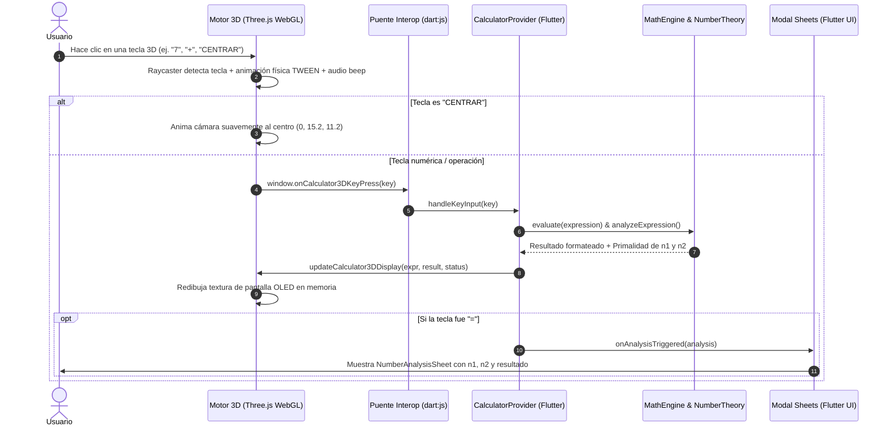

# Guía de Arquitectura, Flujo y Tecnologías - Sumadora Chava 3D

Este documento está diseñado como una **guía pedagógica y técnica completa** para exponer y explicar con claridad el proyecto en clases universitarias o técnicas.

---

## 1. Visión General del Proyecto

**Sumadora Chava 3D** es una aplicación que combina el desarrollo moderno en **Flutter** con gráficos interactivos avanzados en **Three.js (WebGL)**. 
Ofrece dos formas complementarias de interacción:
1. Una **calculadora 3D inmersiva**, donde cada tecla es un objeto tridimensional con respuesta física, sombras, iluminación de estudio y pantalla OLED procedural.
2. Una **capa de lógica y análisis en Flutter**, que evalúa las operaciones matemáticas, determina la primalidad de los operandos ($n_1$ y $n_2$) y muestra paneles modales con efecto *Glassmorphism*.

---

## 2. Estructura de Carpetas y Justificación (Clean Architecture)

El proyecto sigue los principios de **Clean Architecture** y **SOLID**, separando estrictamente la lógica de negocio de la interfaz gráfica y de las tecnologías de renderizado.

```text
sumadora_chava/
├── pubspec.yaml                 # Dependencias y configuración de Flutter
├── web/                         # Entorno WebGL y Scripts JS
│   ├── index.html               # Carga de CDNs (Three.js, Tween.js) y viewport
│   └── js/
│       └── calculator_3d_engine.js # Motor WebGL procedural de la calculadora 3D
├── lib/
│   ├── main.dart                # Punto de entrada de la aplicación Flutter
│   ├── core/                    # Elementos transversales compartidos
│   │   ├── constants/
│   │   │   └── app_colors.dart  # Paleta de colores Cyberpunk / Dark Glass
│   │   └── theme/
│   │       └── app_theme.dart   # Tema global de Flutter (Material 3 Dark)
│   ├── domain/                  # Núcleo de Lógica Pura (Sin UI ni JS)
│   │   ├── entities/
│   │   │   ├── number_analysis.dart   # Entidad con resultado y análisis de n1 y n2
│   │   │   └── prime_factor_tree.dart # Estructuras de árboles de factores
│   │   └── repositories/
│   │       └── i_calculator_engine.dart # Contrato/Interfaz del motor matemático
│   ├── data/                    # Implementación Concreta de Algoritmos
│   │   └── services/
│   │       ├── math_engine_service.dart   # Algoritmo Shunting-Yard y RPN
│   │       └── number_theory_service.dart # Primalidad O(√n) y divisores
│   └── presentation/            # Capa Visual y de Estado
│       ├── providers/
│       │   └── calculator_provider.dart   # State Management (ChangeNotifier)
│       ├── screens/
│       │   └── calculator_3d_screen.dart  # Pantalla principal contenedora
│       └── widgets/
│           ├── glass_container.dart       # Contenedor con desenfoque Glassmorphism
│           ├── n1_n2_operations_sheet.dart# Modal interactivo de 2 números
│           ├── number_analysis_sheet.dart # Modal de resultados limpios
│           ├── three_js_bridge.dart       # Export condicional multiplataforma
│           ├── three_js_bridge_stub.dart  # Stub para plataformas no-web
│           ├── three_js_bridge_web.dart   # Interoperabilidad Dart <-> JS (dart:js)
│           └── three_js_view.dart         # Widget que incrusta el canvas 3D
└── test/                        # Suite de Pruebas Automatizadas
    ├── math_engine_test.dart    # Tests de precedencia y teoría de números
    ├── n1_n2_operations_test.dart # Tests de las 6 operaciones y primalidad
    └── widget_test.dart         # Test de montaje de la interfaz
```

### ¿Por qué se utilizó esta estructura? (Argumentos para la clase)
- **Principio de Responsabilidad Única (SRP)**: Cada archivo hace una sola cosa. `math_engine_service.dart` no sabe nada de botones ni de colores; solo evalúa matemáticas.
- **Independencia del Framework**: La carpeta `domain/` es Dart puro. Si mañana se cambia Flutter por Angular, React o una app de consola, el código de `domain/` y `data/` se reutiliza intacto al 100%.
- **Mantenibilidad y Escalabilidad**: Agregar una nueva operación (como factorial o raíz cúbica) no rompe la interfaz gráfica ni los modelos 3D.
- **Testeabilidad**: Permite escribir pruebas unitarias automatizadas (`flutter test`) que verifican los cálculos en milisegundos sin necesidad de levantar navegadores ni motores gráficos.

---

## 3. Dependencias y Librerías Utilizadas

### En Flutter (`pubspec.yaml`):
1. **`provider: ^6.1.5+1`**:
   - **Propósito**: Gestión del estado reactivo de la aplicación.
   - **Por qué**: Permite que cualquier cambio en la calculadora (`CalculatorProvider`) notifique automáticamente a la pantalla de Flutter y al puente de Three.js sin recrear innecesariamente los widgets ni generar fugas de memoria (*re-renders* innecesarios).
2. **`cupertino_icons: ^1.0.8`**: Iconografía complementaria de alta fidelidad.
3. **`flutter_lints: ^6.0.0`**: Conjunto oficial de reglas de estilo y buenas prácticas de código limpio de Dart.

### En la Capa Web / JavaScript (`web/index.html`):
1. **`three.min.js` (Three.js r128)**:
   - **Propósito**: Biblioteca estándar de gráficos 3D en WebGL.
   - **Por qué**: Permite construir toda la calculadora de forma procedural (sin descargar modelos 3D externos pesados como `.gltf` o `.obj`). Se crean en memoria la geometría del chasis con bordes biselados (`ExtrudeGeometry`), los botones (`BoxGeometry`) y la pantalla LCD.
2. **`OrbitControls.js`**:
   - **Propósito**: Control de cámara 3D con mouse y gestos táctiles.
   - **Por qué**: Permite rotar la calculadora libremente, hacer zoom y explorar sus ángulos con amortiguación (*damping* suave).
3. **`tween.umd.js` (TWEEN.js)**:
   - **Propósito**: Motor de interpolación matemática para animaciones físicas.
   - **Por qué**: Da realismo al pulsar las teclas (bajan en el eje Y y rebotan con función `Back.Out`) y mueve la cámara suavemente al presionar **`CENTRAR`**.
4. **Web Audio API (Nativa del navegador)**:
   - **Propósito**: Sintetizador de audio en tiempo real.
   - **Por qué**: Genera ondas sinusoidales puras para producir el "beep" auditivo al presionar teclas sin requerir archivos de audio `.mp3` o `.wav`.

---

## 4. Algoritmos Clave Implementados

### A. Algoritmo Shunting-Yard (Patio de Maniobras de Dijkstra)
- **Ubicación**: [`lib/data/services/math_engine_service.dart`](file:///c:/Users/Lenovo/sumadora_chava/lib/data/services/math_engine_service.dart)
- **Función**: Convierte expresiones en notación infija (ej: `2 + 3 * 4`) a notación postfija / RPN (`2 3 4 * +`).
- **Por qué es necesario**: Garantiza que la multiplicación, división y potencia tengan mayor precedencia que la suma y la resta, resolviendo paréntesis anidados de forma correcta sin usar la peligrosa función `eval()` de JavaScript.

### B. Primalidad con Complejidad Optimizada $O(\sqrt{n})$
- **Ubicación**: [`lib/data/services/number_theory_service.dart`](file:///c:/Users/Lenovo/sumadora_chava/lib/data/services/number_theory_service.dart)
- **Función**: Determina si $n_1$, $n_2$ o el resultado son números primos.
- **Optimización**:
  1. Si $n \le 1$, no es primo.
  2. 2 y 3 son primos directos.
  3. Descarta todos los múltiplos de 2 y 3 en tiempo $O(1)$.
  4. Recorre únicamente los números de la forma $6k \pm 1$ hasta $\sqrt{n}$. Esto reduce las iteraciones en más de un 66% respecto a la comprobación tradicional.

---

## 5. El Flujo de Funcionamiento (Paso a Paso)



### Explicación detallada del ciclo de vida:

1. **Inicialización**:
   - `main()` arranca la aplicación Flutter e inyecta `CalculatorProvider`.
   - `Calculator3DScreen` crea un contenedor HTML a través de `ui_web.platformViewRegistry` y monta el canvas de Three.js.
   - `calculator_3d_engine.js` inicializa la escena, las luces de estudio, el chasis procedural y la textura dinámica de la pantalla LCD OLED.

2. **Detección de Clics en el Espacio 3D (Raycasting)**:
   - Cuando el usuario hace clic o toca la pantalla, se proyecta un rayo invisible (`THREE.Raycaster`) desde la posición del cursor a través de la cámara 3D.
   - El rayo calcula qué botón de la calculadora fue intersectado.
   - Se ejecuta una animación física TWEEN que baja el botón en el eje vertical y lo regresa con rebote, emitiendo un pulso de luz y sonido.

3. **Puente Bidireccional Dart <-> JavaScript**:
   - **De JS a Dart**: El motor 3D llama a la función global registrada `window.onCalculator3DKeyPress(label)`. El archivo `three_js_bridge_web.dart` recibe este valor en Dart y lo entrega a `CalculatorProvider.handleKeyInput(key)`.
   - **De Dart a JS**: Cada vez que el estado de Dart cambia, `ThreeJSView` invoca `updateThreeJSDisplay(expression, result, status)`. El motor en JavaScript redibuja el `CanvasRenderingContext2D` de la pantalla OLED a 1200x460 píxeles, actualizando la textura procedural del modelo 3D sin parpadeos.

4. **Modo Alternativo "Operaciones n1 y n2"**:
   - Si el usuario prefiere ingresar los dos números directamente en lugar de usar el teclado 3D, presiona el botón superior **`OPERACIONES N1 Y N2`**.
   - Se despliega `N1N2OperationsSheet` en Flutter nativo con *Glassmorphism*.
   - El usuario ingresa $n_1$ y $n_2$ y ve en vivo:
     - Si $n_1$ es primo y por qué.
     - Si $n_2$ es primo y por qué.
     - Los resultados calculados de **Suma**, **Resta**, **Multiplicación**, **División**, **Residuo (%)** y **Potencia (^)**.
   - Al tocar cualquier fila, la operación se transfiere a la calculadora 3D y se evalúa instantáneamente.

5. **Centrado de Cámara Procedural**:
   - Si el usuario rota la calculadora y desea volver a la vista frontal, presiona el botón **`CENTRAR`** situado en la fila superior del teclado 3D (junto a `HISTORIAL`).
   - TWEEN.js interpola suavemente la posición de la cámara a `(0, 15.2, 11.2)` y el objetivo de órbita a `(0, 0, 0)`, actualizando los controles en cada fotograma.

---

## 6. Puntos Clave para Destacar en la Exposición

1. **Cero Modelos Externos (Zero Assets)**: Toda la calculadora se genera por código en tiempo de ejecución. No requiere descargar archivos `.obj` o `.gltf` de varios megabytes.
2. **Arquitectura Limpia**: Clara separación entre Dominio, Datos y Presentación.
3. **Interoperabilidad Fluida**: Comunicación en tiempo real y sin retardo perceptible entre Flutter y WebGL.
4. **Validación Formal**: 20 pruebas unitarias automatizadas (`flutter test`) que cubren operaciones aritméticas, divisiones por cero, casos extremos de primalidad y renderizado de widgets.
